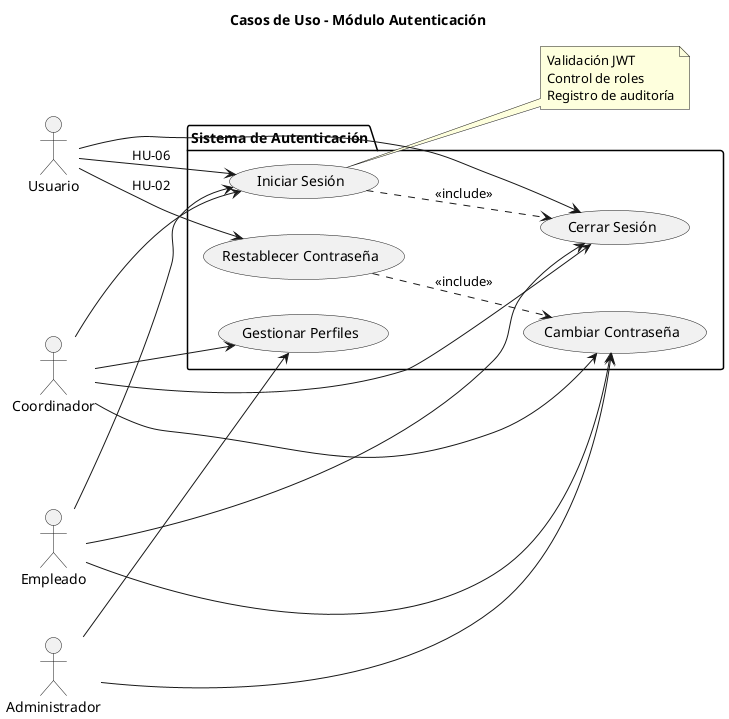
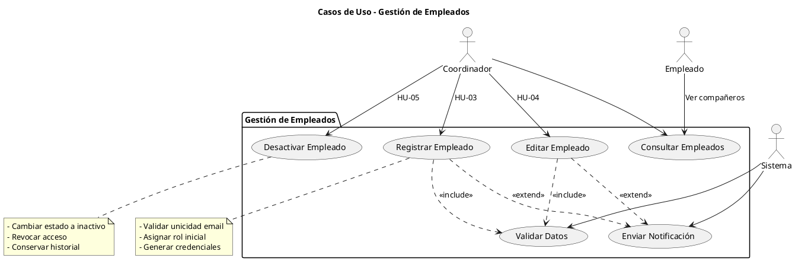
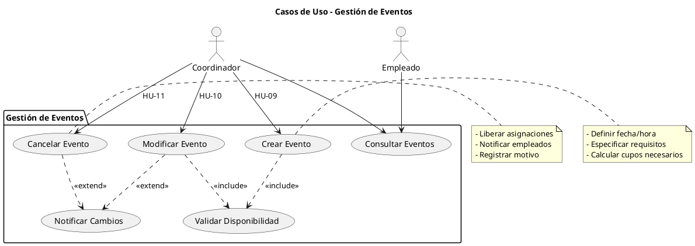
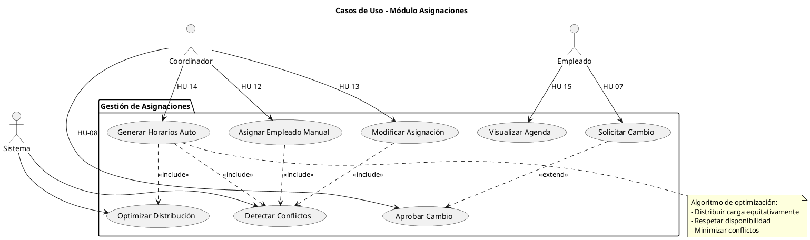
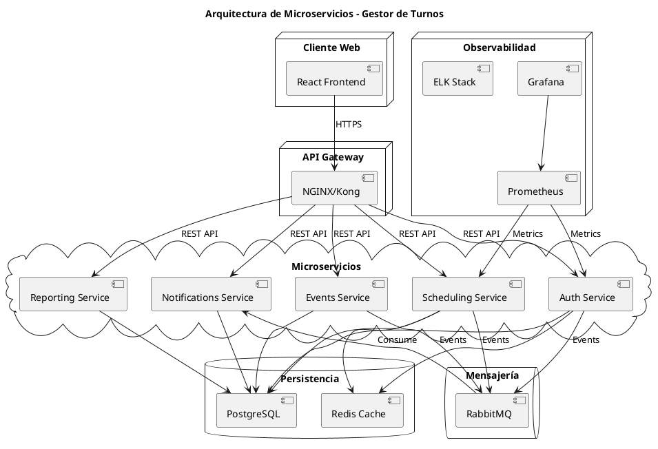
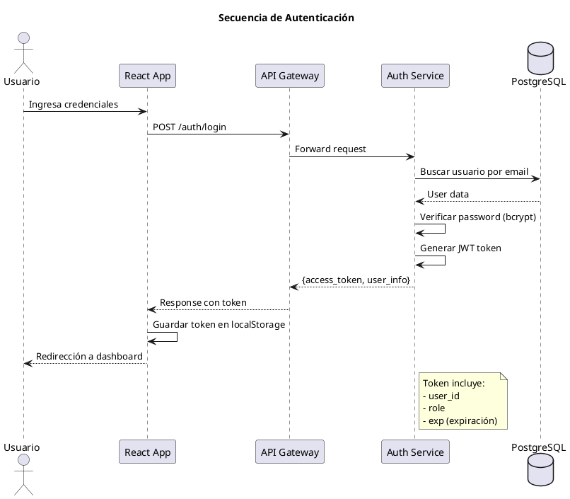
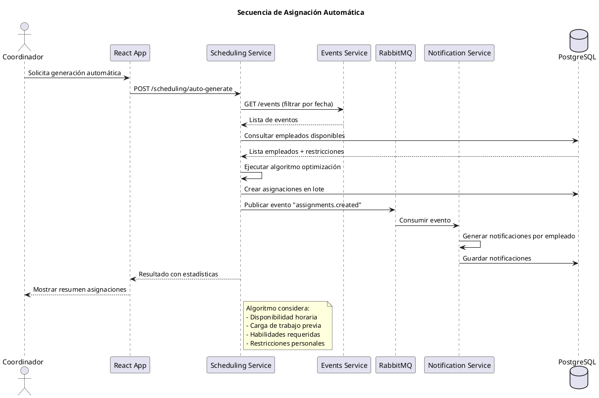

# 📊 Catálogo de Diagramas - Gestor de Turnos

## 🎯 **Diagramas Requeridos para el Proyecto**

### **📋 Lista Completa de Gráficas:**

1. **Gráfica 1**: Diagrama de Casos de Uso General
2. **Gráfica 2**: Casos de Uso - Módulo Autenticación  
3. **Gráfica 3**: Casos de Uso - Módulo Gestión Empleados
4. **Gráfica 4**: Casos de Uso - Módulo Gestión Eventos
5. **Gráfica 5**: Casos de Uso - Módulo Asignaciones
6. **Gráfica 6**: Diagrama de Modelo de Datos (ER)
7. **Gráfica 7**: Arquitectura de Microservicios
8. **Gráfica 8**: Flujo de Procesos de Negocio
9. **Gráfica 9**: Diagrama de Secuencia - Login
10. **Gráfica 10**: Diagrama de Secuencia - Asignación Automática
11. **Gráfica 11**: Arquitectura de Despliegue
12. **Gráfica 12**: Wireframes - Pantallas Principales

---

## 🛠️ **Herramientas Recomendadas**

### **Opción 1: Draw.io (Gratuita y Fácil) ⭐ RECOMENDADA**
- **URL**: https://app.diagrams.net/
- **Ventajas**: 
  - Gratuita y online
  - Plantillas UML integradas
  - Exporta a PNG, PDF, SVG
  - Integración con Google Drive/GitHub
  - Símbolos para casos de uso, ER, arquitectura

### **Opción 2: Lucidchart (Profesional)**
- **URL**: https://lucid.app/
- **Ventajas**:
  - Interface profesional
  - Colaboración en tiempo real
  - Templates académicos
  - Versión gratuita limitada

### **Opción 3: PlantUML (Código)**
- **URL**: https://plantuml.com/
- **Ventajas**:
  - Diagramas como código
  - Versionable con Git
  - Perfecto para desarrolladores
  - Integración VS Code

### **Opción 4: Figma (Para Wireframes)**
- **URL**: https://figma.com/
- **Ventajas**:
  - Ideal para UI/UX
  - Wireframes y mockups
  - Colaboración equipo
  - Gratuito para estudiantes

---

## 📐 **GRÁFICA 1: Diagrama de Casos de Uso General**

### **Descripción:**
Vista completa del sistema con todos los actores y casos de uso principales.

### **Diseño en Draw.io:**

```
Actores:
┌─────────────────┐
│   Coordinador   │ (Principal)
└─────────────────┘

┌─────────────────┐
│   Empleado      │ (Secundario)  
└─────────────────┘

┌─────────────────┐
│  Administrador  │ (Sistema)
└─────────────────┘

Sistema: "Gestor de Turnos"
┌─────────────────────────────────────────────┐
│                                             │
│  • Autenticar Usuario                       │
│  • Gestionar Empleados                     │
│  • Crear Eventos                           │
│  • Asignar Turnos                          │
│  • Generar Horarios Automáticos            │
│  • Enviar Notificaciones                   │
│  • Generar Reportes                        │
│  • Consultar Agenda Personal               │
│                                             │
└─────────────────────────────────────────────┘
```

### **Pasos en Draw.io:**
1. Crear nuevo diagrama → UML → Use Case Diagram
2. Agregar 3 actores (Actor shape)
3. Crear sistema boundary (Rectangle)
4. Agregar 8 casos de uso (Ellipse shapes)  
5. Conectar con líneas (Connector tool)

---

## 📐 **GRÁFICA 2: Casos de Uso - Autenticación**

### **PlantUML Code (Copia y pega en plantuml.com):**



---

## 📐 **GRÁFICA 3: Casos de Uso - Gestión Empleados**

### **PlantUML Code:**



---

## 📐 **GRÁFICA 4: Casos de Uso - Gestión Eventos**

### **PlantUML Code:**



---

## 📐 **GRÁFICA 5: Casos de Uso - Asignaciones**

### **PlantUML Code:**



---

## 📐 **GRÁFICA 6: Modelo de Datos (ER)**

### **Herramienta recomendada**: Draw.io con template "Entity Relationship"

### **Entidades principales:**

```
┌─────────────────┐    ┌─────────────────┐    ┌─────────────────┐
│      User       │    │    Employee     │    │     Event       │
├─────────────────┤    ├─────────────────┤    ├─────────────────┤
│ id (PK)         │    │ id (PK)         │    │ id (PK)         │
│ email           │    │ user_id (FK)    │    │ title           │
│ password_hash   │    │ first_name      │    │ description     │
│ role            │    │ last_name       │    │ date            │
│ created_at      │    │ phone           │    │ start_time      │
│ updated_at      │    │ status          │    │ end_time        │
└─────────────────┘    │ hire_date       │    │ location        │
                       │ created_at      │    │ status          │
                       └─────────────────┘    │ created_at      │
                                              └─────────────────┘

┌─────────────────┐    ┌─────────────────┐    ┌─────────────────┐
│   Assignment    │    │  Notification   │    │     Report      │
├─────────────────┤    ├─────────────────┤    ├─────────────────┤
│ id (PK)         │    │ id (PK)         │    │ id (PK)         │
│ employee_id(FK) │    │ user_id (FK)    │    │ title           │
│ event_id (FK)   │    │ type            │    │ content         │
│ role            │    │ message         │    │ generated_by(FK)│
│ status          │    │ sent_at         │    │ created_at      │
│ assigned_at     │    │ read_at         │    │ filters         │
│ notes           │    └─────────────────┘    └─────────────────┘
└─────────────────┘
```

### **Relaciones:**
- User (1) → (0,*) Employee
- Employee (0,*) → (0,*) Event (através Assignment)
- User (1) → (0,*) Notification
- User (1) → (0,*) Report

---

## 📐 **GRÁFICA 7: Arquitectura de Microservicios**

### **PlantUML Code (Deployment Diagram):**



---

## 📐 **GRÁFICA 8: Flujo de Procesos de Negocio**

### **Draw.io - Business Process Model:**

```
Proceso: "Asignación de Turnos"

[Inicio] → [Crear Evento] → [¿Asignación Manual?] 
                                   ↓ NO
                           [Ejecutar Algoritmo Automático]
                                   ↓
                           [Verificar Disponibilidad]
                                   ↓
                           [Detectar Conflictos] → [¿Hay Conflictos?]
                                                        ↓ SÍ
                                                  [Resolver Conflictos]
                                                        ↓ NO
                           [Confirmar Asignaciones] 
                                   ↓
                           [Enviar Notificaciones]
                                   ↓
                                 [Fin]
```

---

## 📐 **GRÁFICA 9: Diagrama de Secuencia - Login**

### **PlantUML Code:**



---

## 📐 **GRÁFICA 10: Diagrama de Secuencia - Asignación Automática**

### **PlantUML Code:**



---

## 🛠️ **INSTRUCCIONES PASO A PASO**

### **Para Draw.io (Casos de Uso):**

1. **Acceder**: Ir a https://app.diagrams.net/
2. **Nuevo diagrama**: Create New Diagram → UML → Use Case
3. **Agregar actores**:
   - Buscar "Actor" en la barra izquierda
   - Arrastrar 3 actores al canvas
   - Renombrar: Coordinador, Empleado, Administrador

4. **Crear sistema boundary**:
   - Usar Rectangle tool
   - Dibujar marco alrededor del área central
   - Agregar título: "Gestor de Turnos"

5. **Agregar casos de uso**:
   - Buscar "Use Case" (óvalo)
   - Crear 8-10 casos según el módulo
   - Nombrar según las HU

6. **Conectar elementos**:
   - Usar Connector tool
   - Líneas sólidas: Actor → Use Case
   - Líneas punteadas: <<include>>, <<extend>>

### **Para PlantUML (Secuencias/Arquitectura):**

1. **Acceder**: Ir a https://plantuml.com/plantuml
2. **Copiar código**: Usa los códigos que proporcioné arriba
3. **Generar**: Click en "Submit" 
4. **Exportar**: Download como PNG/SVG/PDF

### **Para el Modelo de Datos:**

1. **Draw.io**: Template "Entity Relationship"
2. **Agregar entidades**: Usar Rectangle + Text
3. **Definir atributos**: Lista dentro de cada entidad
4. **Conectar relaciones**: Lines con cardinalidad (1, *, 0..1)

---

## 📋 **Checklist de Diagramas**

### **Para entregar:**
- [ ] **Gráfica 1**: Casos de Uso General (PNG + Draw.io)
- [ ] **Gráfica 2**: Casos de Uso Autenticación (PNG + PlantUML)  
- [ ] **Gráfica 3**: Casos de Uso Empleados (PNG + PlantUML)
- [ ] **Gráfica 4**: Casos de Uso Eventos (PNG + PlantUML)
- [ ] **Gráfica 5**: Casos de Uso Asignaciones (PNG + PlantUML)
- [ ] **Gráfica 6**: Modelo de Datos ER (PNG + Draw.io)
- [ ] **Gráfica 7**: Arquitectura Microservicios (PNG + PlantUML)
- [ ] **Gráfica 8**: Flujo Procesos (PNG + Draw.io)
- [ ] **Gráfica 9**: Secuencia Login (PNG + PlantUML)
- [ ] **Gráfica 10**: Secuencia Asignación (PNG + PlantUML)

### **Formatos a entregar:**
- **PNG/JPG**: Para insertar en documentos Word
- **PDF**: Para presentaciones  
- **Archivos fuente**: .drawio, .puml para modificaciones

¿Quieres que genere algún diagrama específico primero o prefieres que te guíe paso a paso con una herramienta en particular?