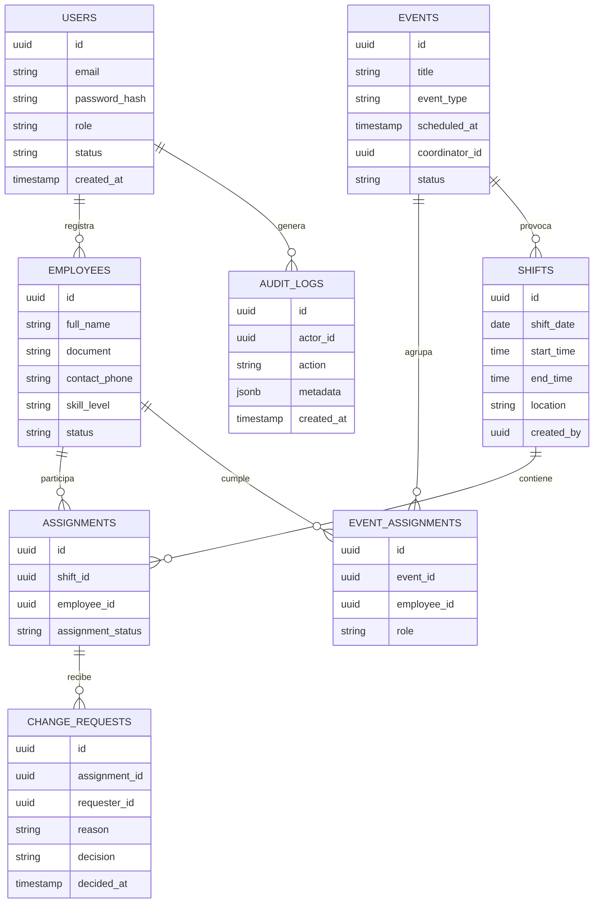

# Gestor de Turnos – Documento Académico Actualizado

> Última actualización: 2 de octubre de 2025

## Tabla de contenido
1. [Puerto Peñalisa](#puerto-peñalisa)
2. [Agradecimientos](#agradecimientos)
3. [Resumen](#resumen)
4. [Introducción](#1-introducción)
5. [Objetivos](#2-objetivos)
6. [Planteamiento del problema](#3-planteamiento-del-problema)
7. [Usabilidad](#4-usabilidad)
8. [Árbol del problema](#5-árbol-del-problema)
9. [Backlog priorizado](#6-backlog)
10. [Proceso de diseño](#7-proceso-de-diseño)
11. [Investigación de usuarios](#8-investigación-de-usuarios)
12. [Historias de usuario](#9-historias-de-usuario)
13. [Modelo de datos](#10-modelo-de-datos)
14. [Diagrama de casos de uso](#11-diagrama-de-casos-de-uso)
15. [Conclusiones](#12-conclusiones)
16. [Listas de tablas y gráficas](#13-listas-de-tablas-y-gráficas)

---

## Puerto Peñalisa
El Club Puerto Peñalisa, ubicado en Ricaurte (Cundinamarca, Colombia), ofrece servicios deportivos y recreativos a sus socios. El área de tenis cuenta con caddies (“caddies de cancha”) que apoyan a los jugadores durante prácticas y partidos. Actualmente, la asignación de turnos se gestiona de forma manual mediante hojas de cálculo y mensajes informales, lo que genera conflictos, tiempos muertos y poca trazabilidad en el uso del recurso humano.

## Agradecimientos
Agradecemos al cuerpo docente de las asignaturas **Gestión de Proyectos**, **Sistemas Distribuidos** y **Calidad de Software**, así como al personal del Club Puerto Peñalisa que compartió información operativa y permitió realizar entrevistas y observaciones.

## Resumen
El proyecto **Gestor de Turnos** busca construir una plataforma distribuida que automatice la asignación de turnos de caddies, permita gestionar eventos deportivos y ofrezca reportes de uso a los coordinadores del club. Se adopta una arquitectura basada en microservicios implementados con NestJS y un frontend React, respaldados por PostgreSQL y RabbitMQ. El proyecto cubre competencias de tres materias universitarias, integrando prácticas de planificación de proyectos, diseño de sistemas distribuidos y aseguramiento de la calidad.

## 1. Introducción
La planificación manual de turnos en el área de tenis del Club Puerto Peñalisa provoca sobrecarga administrativa, conflictos de disponibilidad y falta de transparencia. Este proyecto plantea una solución tecnológica que consolide reglas de negocio, gestione solicitudes de cambio y brinde información confiable para la toma de decisiones.

El documento presenta la justificación, objetivos, investigación de usuarios y artefactos clave (backlog, historias de usuario, diagramas) que guiarán el desarrollo y validación del producto.

## 2. Objetivos
### 2.1 Objetivo general
Desarrollar una plataforma distribuida que permita administrar turnos de caddies, eventos deportivos y solicitudes de cambio, mejorando la equidad y eficiencia operativa del Club Puerto Peñalisa antes del 15 de diciembre de 2025.

### 2.2 Objetivos específicos
- Analizar el contexto actual y definir requisitos funcionales y no funcionales medibles.
- Implementar microservicios desacoplados para autenticación, programación de turnos, eventos y notificaciones.
- Integrar un frontend web responsive que facilite la interacción de coordinadores y caddies.
- Establecer un plan de calidad con métricas de cobertura, rendimiento y satisfacción.
- Entregar reportes de desempeño y tableros de seguimiento para los responsables del club.

## 3. Planteamiento del problema
### 3.1 Definición del problema
La gestión manual de turnos provoca asignaciones duplicadas, falta de control sobre horas trabajadas y poca visibilidad del cumplimiento de los caddies. Esta situación genera inconformidad entre el personal y los socios, e incrementa el riesgo de eventos sin personal.

### 3.2 Justificación
Un sistema especializado permitirá:
- Automatizar la asignación y reprogramación de turnos.
- Aplicar reglas de negocio transparentes (disponibilidad, experiencia, prioridad, horas máximas).
- Registrar historial de cambios y auditorías para mejorar la confianza.
- Generar reportes que sustenten decisiones de recursos humanos.

## 4. Usabilidad
El diseño se centra en ofrecer una experiencia clara y accesible para todos los roles. Las principales directrices son:
- **Simplicidad:** Formularios con los campos esenciales y flujos guiados.
- **Consistencia:** Componentes reutilizables y paleta de colores coherente.
- **Retroalimentación inmediata:** Mensajes claros ante acciones exitosas o con errores.
- **Accesibilidad:** Compatibilidad con lectores de pantalla (WCAG 2.1 AA), opciones de contraste y tamaños de letra ajustables.
- **Eficiencia:** Búsqueda rápida de turnos, filtros, atajos para acciones frecuentes.
- **Prevención de errores:** Validaciones en tiempo real, confirmaciones antes de acciones críticas, opción de deshacer.
- **Personalización:** Preferencias de notificaciones y vista del calendario adaptadas por usuario.

## 5. Árbol del problema
- **Causas (raíces):** Falta de seguimiento, mala administración de turnos, procesos informales, ausencia de herramientas digitales, comunicación dispersa.
- **Problema (tallo):** Conflictos, desorden y desmotivación por la falta de un sistema claro de turnos.
- **Efectos (frutos):** Servicios inconsistentes para los socios, desgaste del personal, pérdida de confianza y posibles impactos económicos.

## 6. Backlog
| Prioridad | Funcionalidad | Descripción resumida |
| --- | --- | --- |
| 1 | Inicio de sesión y autenticación | Acceso seguro con roles (Administrador, Coordinador, Caddie). |
| 2 | Gestión de usuarios | Registrar, editar, desactivar usuarios y asignar roles. |
| 3 | Registrar empleados | Mantener información de caddies (habilidades, disponibilidad). |
| 4 | Gestión de contraseñas | Recuperar y actualizar credenciales de forma segura. |
| 5 | Crear turnos | Definir turnos manualmente (fecha, hora, lugar, responsable). |
| 6 | Generar horarios automáticos | Asignación inteligente con reglas de negocio configurables. |
| 7 | Gestionar eventos | Crear/editar/eliminar eventos (partidos, prácticas). |
| 8 | Asignar caddies a eventos | Relacionar turnos con eventos y roles específicos. |
| 9 | Solicitar cambios de turno | Permitir al caddie proponer cambios justificados. |
| 10 | Aprobar/rechazar cambios | Coordinador toma decisiones, registra motivos. |
| 11 | Notificaciones | Enviar correos/alertas por asignaciones y cambios. |
| 12 | Reportes | Consultar asistencia, horas trabajadas, métricas de desempeño. |
| 13 | Dashboard ejecutivo | Visualizar KPIs (conflictos resueltos, distribución de horas). |
| 14 | Auditoría | Historial de acciones y trazabilidad de cambios. |

## 7. Proceso de diseño
El equipo adoptó un enfoque iterativo:
1. **Indagación:** entrevistas con coordinadores y caddies, observación de procesos actuales.
2. **Definición:** consolidación de requisitos y priorización del backlog.
3. **Ideación:** construcción de flujos de navegación y prototipos de baja fidelidad (herramientas: diagrams.net, Figma).
4. **Prototipado:** diseño de interfaces clave y validación rápida con usuarios.
5. **Desarrollo incremental:** implementación de microservicios y frontend en iteraciones quincenales.
6. **Evaluación:** pruebas funcionales, de usabilidad y retroalimentación continua.

## 8. Investigación de usuarios
- **Entrevistas:** 4 coordinadores y 6 caddies (identificando necesidades, problemas y expectativas).
- **Encuestas:** confirmaron que el 80 % percibe falta de claridad en la asignación actual.
- **Análisis comparativo:** revisión de aplicaciones similares (ClubSpark, CourtReserve) para identificar buenas prácticas.
- **Personas:**
  - *Carolina (Coordinadora)*: necesita visibilidad total y rapidez para resolver conflictos.
  - *Julián (Caddie)*: quiere claridad sobre sus turnos y facilidad para solicitar cambios.
- **Escenarios principales:** asignación semanal de turnos, gestión de eventos especiales, coberturas de ausencias.

## 9. Historias de usuario
| Historia | Rol | Finalidad | Criterios de aceptación |
| --- | --- | --- | --- |
| HU-LOGIN | Administrador | Iniciar sesión con seguridad | Autenticación con email/contraseña, bloqueo tras 5 intentos fallidos, registro en auditoría. |
| HU-USUARIOS | Coordinador | Registrar y gestionar usuarios | Crear/editar/desactivar usuarios; validación de campos obligatorios; confirmación antes de desactivar. |
| HU-EMPLEADOS | Coordinador | Registrar datos de caddies | Capturar disponibilidad, habilidades, contacto; evitar duplicados. |
| HU-TURNOS-AUTO | Coordinador | Generar horarios automáticamente | Algoritmo asigna caddies según reglas; mostrar vista previa editable; permitir guardar o descartar. |
| HU-SOLICITUD-CAMBIO | Caddie | Solicitar cambio de turno | Crear solicitud con motivo; notificar al coordinador; ver estado (pendiente/aprobado/rechazado). |
| HU-NOTIFICACIONES | Coordinador | Informar cambios automáticamente | Enviar correo y notificación in-app cuando se crea, modifica o cancela un turno. |
| HU-REPORTES | Dirección | Consultar métricas | Generar reporte PDF/Excel; filtrar por rango de fechas; métricas de asistencia y horas. |

## 10. Modelo de datos
El esquema de base de datos en PostgreSQL se diseñó para soportar las operaciones principales del sistema y permitir su crecimiento. La siguiente vista lógica resume las entidades y relaciones clave.

### Tabla resumen de entidades
| Entidad | Descripción | Campos clave |
| --- | --- | --- |
| `users` | Usuarios del sistema y roles (Administrador, Coordinador, Caddie). | `id`, `email` (único), `role`, `status` |
| `employees` | Perfil laboral de los caddies (puede haber caddies externos). | `id`, `full_name`, `skill_level`, `status` |
| `shifts` | Turnos planificados manual o automáticamente. | `shift_date`, `start_time`, `end_time`, `location` |
| `assignments` | Relación turno–caddie y estado (confirmado, pendiente, liberado). | `shift_id`, `employee_id`, `assignment_status` |
| `events` | Partidos o prácticas, vinculados a turnos y coordinadores. | `title`, `event_type`, `scheduled_at`, `coordinator_id` |
| `event_assignments` | Roles específicos de caddies dentro del evento. | `event_id`, `employee_id`, `role` |
| `change_requests` | Solicitudes de cambio de turno y su decisión. | `assignment_id`, `requester_id`, `reason`, `decision` |
| `audit_logs` | Registro de acciones sensibles. | `actor_id`, `action`, `metadata` |

### Consideraciones adicionales
- Todas las claves primarias son `UUID` para facilitar la distribución entre microservicios.
- `audit_logs.metadata` utiliza `JSONB` para registrar información contextual (IP, payload resumido, etc.).
- Las tablas `employees` y `users` están separadas para permitir personal externo (contratistas) o personal administrativo sin permisos de acceso al sistema.
- Se aplicarán índices compuestos (`shift_date`, `location`) para agilizar consultas del calendario y (`employee_id`, `assignment_status`) para reportes de disponibilidad.
- Las migraciones se gestionarán con TypeORM en cada microservicio que acceda a la base.

> El diagrama editable se guardará en `docs/overview/modelo-datos.drawio`. Cada vez que se modifique la estructura, actualizar tanto este archivo como la sección de resumen anterior.

## 11. Diagrama de casos de uso
- **Actores:** Administrador, Coordinador, Caddie.
- **Casos de uso clave:** autenticación, gestionar usuarios, gestionar turnos, gestionar eventos, solicitar cambio, aprobar cambio, consultar reportes.

> *Nota:* El diagrama actualizado se mantendrá en `docs/overview/casos-de-uso.drawio`. Se incluye una vista previa en la entrega final.

## 12. Conclusiones
La transformación digital de la gestión de turnos en Puerto Peñalisa permitirá:
- Mejorar la satisfacción tanto de caddies como de socios mediante procesos transparentes.
- Reducir la carga administrativa con automatizaciones y reglas configurables.
- Contar con indicadores que sustenten decisiones estratégicas del club.
- Demostrar las competencias adquiridas en gestión de proyectos, sistemas distribuidos y calidad de software a través de un producto tangible y documentado.

## 13. Listas de tablas y gráficas
- **Tabla 1.** Backlog priorizado (ver sección 6).
- **Tabla 2.** Historias de usuario (ver sección 9).

### Gráficas (por elaborar)
1. Flujo de autenticación.
2. Gestión de usuarios.
3. Gestión de empleados.
4. Gestión de eventos.
5. Asignación de caddies a eventos.
6. Generación automática de horarios.
7. Consulta de horarios y asignaciones.
8. Solicitud de cambio.
9. Aprobación o rechazo de cambios.
10. Resolución de conflictos.

> Las gráficas se producirán en la herramienta diagrams.net y se exportarán a formato PNG/PDF para incluirlas en anexos. Los archivos editables se almacenarán en `docs/overview/diagramas/` para facilitar su actualización.

---
**Autor principal:** Jhoan Góngora  
**Colaboradores simulados:** Ana Martínez (PO), Carlos Rodríguez (Tech Lead)
